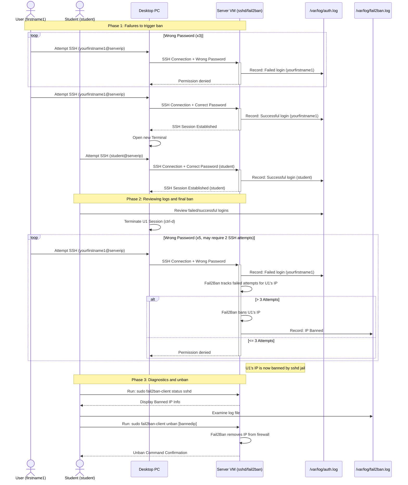

```mermaid
  sequenceDiagram
    %% Define Participants
    actor U1 as User (firstname1)
    actor U2 as Student (student)
    participant Desktop as Desktop PC
    participant Server as Server VM (sshd/fail2ban)
    participant AuthLog as /var/log/auth.log
    participant Fail2BanLog as /var/log/fail2ban.log
    
    %% Section 1: Intentional Login Failures
    Note over U1, Server: Phase 1: Failures to trigger ban
    
    loop Wrong Password (x3)
        U1->>Desktop: Attempt SSH (yourfirstname1@serverip)
        Desktop->>+Server: SSH Connection + Wrong Password
        Server->>AuthLog: Record: Failed login (yourfirstname1)
        Server-->>-Desktop: Permission denied
    end
    
    U1->>Desktop: Attempt SSH (yourfirstname1@serverip)
    Desktop->>+Server: SSH Connection + Correct Password
    Server->>AuthLog: Record: Successful login (yourfirstname1)
    Server-->>-Desktop: SSH Session Established
    
    Desktop->>Desktop: Open new Terminal
    U2->>Desktop: Attempt SSH (student@serverip)
    Desktop->>+Server: SSH Connection + Correct Password (student)
    Server->>AuthLog: Record: Successful login (student)
    Server-->>-Desktop: SSH Session Established (student)
    
    %% Section 2: Reviewing Logs & Triggering the Ban
    Note over U2, Server: Phase 2: Reviewing logs and final ban
    
    U2->>AuthLog: Review failed/successful logins
    
    Desktop->>Desktop: Terminate U1 Session (ctrl-d)
    
    loop Wrong Password (x5, may require 2 SSH attempts)
        U1->>Desktop: Attempt SSH (yourfirstname1@serverip)
        Desktop->>+Server: SSH Connection + Wrong Password
        Server->>AuthLog: Record: Failed login (yourfirstname1)
        Server->>Server: Fail2Ban tracks failed attempts for U1's IP
        alt > 3 Attempts
            Server->>Server: Fail2Ban bans U1's IP
            Server->>Fail2BanLog: Record: IP Banned
        else <= 3 Attempts
            Server-->>-Desktop: Permission denied
        end
    end
    
    Note right of Server: U1's IP is now banned by sshd jail
    
    %% Section 3: Examination and Unban
    Note over U2, Server: Phase 3: Diagnostics and unban
    
    U2->>Server: Run: sudo fail2ban-client status sshd
    Server-->>U2: Display Banned IP Info
    
    U2->>Fail2BanLog: Examine log file
    
    U2->>Server: Run: sudo fail2ban-client unban [bannedip]
    Server->>Server: Fail2Ban removes IP from firewall
    Server-->>U2: Unban Command Confirmation
```
