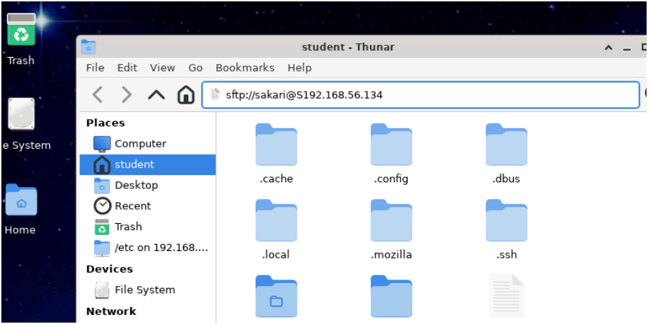
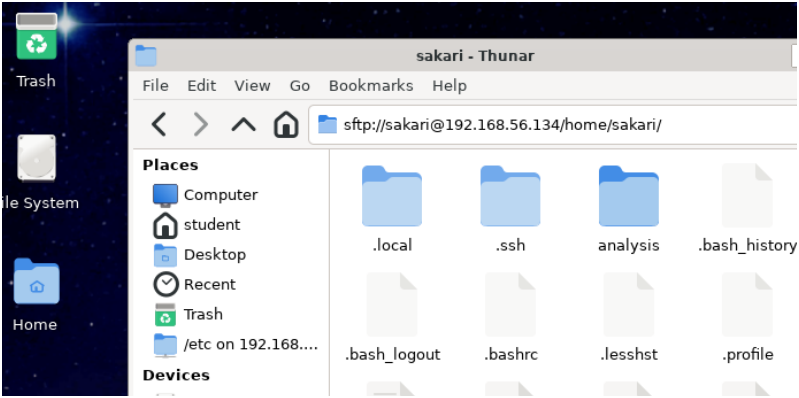
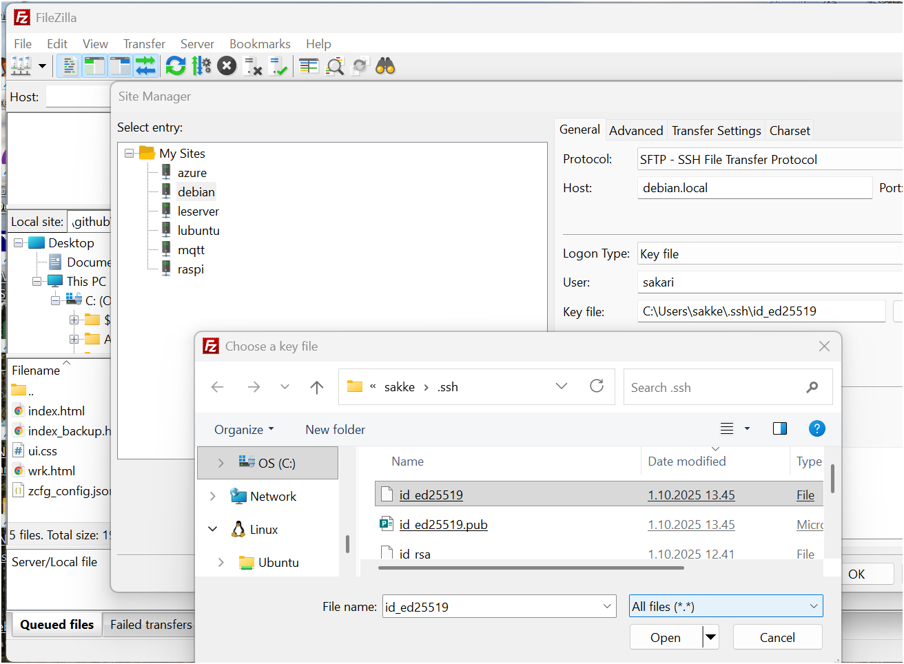

# SSH Secure File Transfer (SFTP) – Demonstration

SFTP (Secure File Transfer Protocol) is built upon SSH.
It makes it possible to transfer files between client and server securely.

* Linux desktops have built-in graphic SFTP clients integrated into their file-manager programs. 
* On Windows and macOS a graphical SFTP client like **FileZilla** can be used (open-source with SFTP support).

In this demonstration, we show how to use an SFTP client with already configured **SSH-key based authentication**.

---

## SFTP Client in Linux

### Step 1: Connect to the Remote Server using sftp protocol and your user account 

Using **Desktop Linux file manager**’s integrated SFTP feature:

*Figure 1: Connecting to remote server using integrated file manager and SFTP protocol - no password required if SSH keybased authentication is configured for user*

---

### Step 2: View the Remote Home Folder

After connecting, you can browse the home folder on the server.
Make sure hidden files are visible (e.g., `.ssh`, `.bashrc`, etc.).

*Figure 2: Viewing home folder in server after connection (note: show hidden files enabled).*

---

## Notes

* Authentication is done with preconfigured SSH keys.
* Default port: `22`
* Path: `/home/<username>`

---

## SFTP Client in Windows and macOS
FileZilla client application supports cleartext FTP and encrypted SFTP file transfer application protocols. You will configure the client to use SFTP-protocol and the previously generated public/private -keys to authenticate so that we can safely transfer files between windows-computer and Linux server. Download [Filezilla](https://filezilla-project.org/download.php?show_all=1) and install it.

### Step 1: Define connection to remote server using SFTP and keybased authentication  

After you have connected to remoter server, you can transfer files between your computer and server. You get a graphical interface that shows directory trees in server and client. You can also set file permissions in the Linux server without memorizing file permissions setting commands and their options. 
